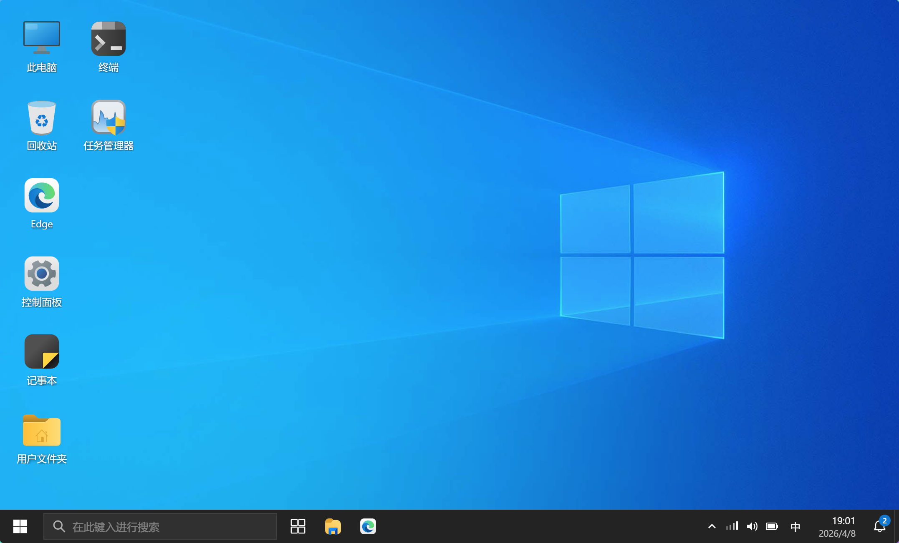
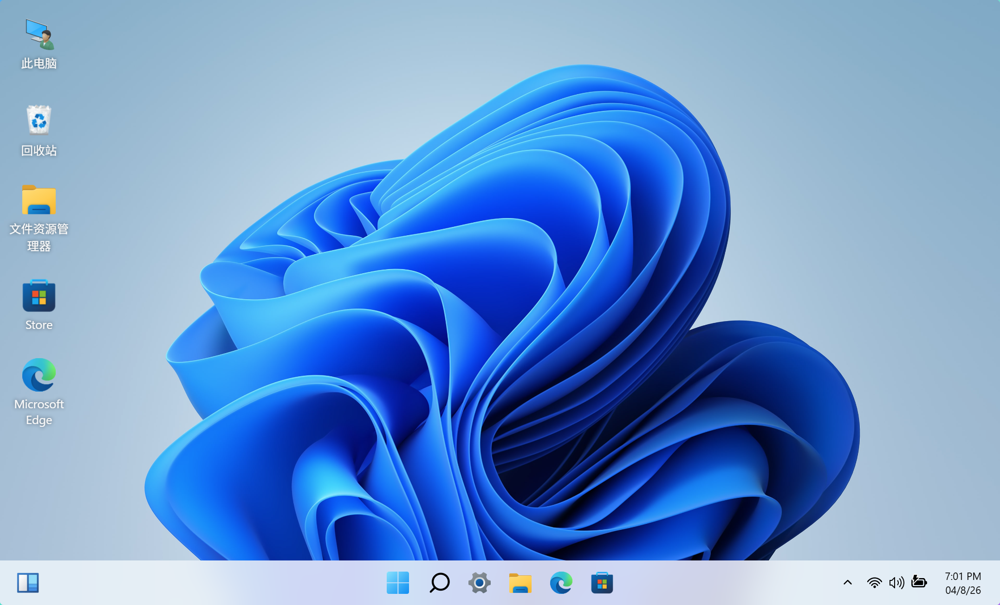
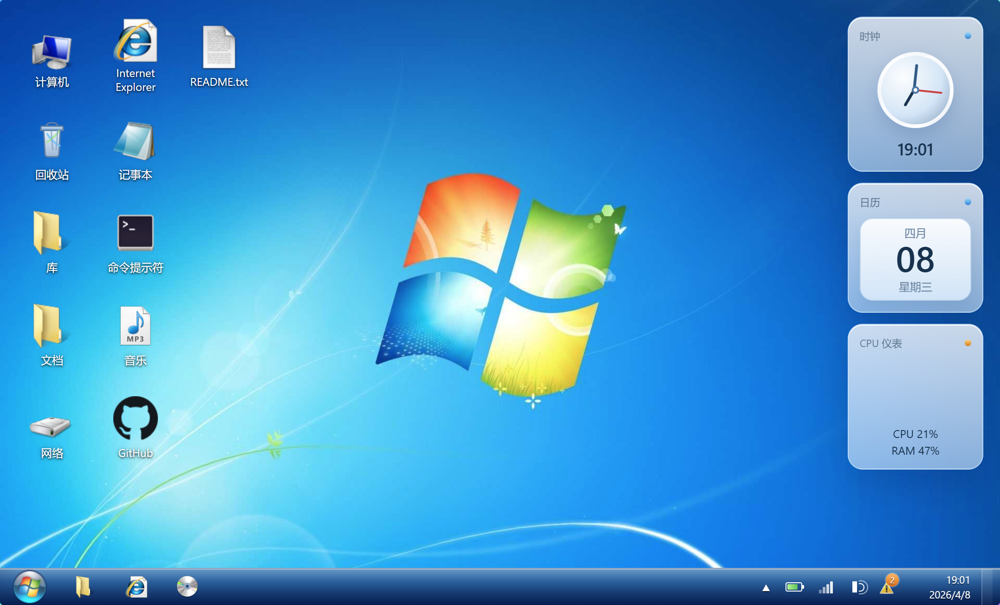

<h1 align="center">fake-windows</h1>

<p align="center">
   在浏览器中复刻 Windows 7、Windows 10、Windows 11 的桌面体验
</p>

<p align="center">
   一个同时收录原生静态实现与 React 桌面壳层实现的多版本 Windows UI 模拟项目。
</p>

<p align="center">
   <a href="https://github.com/liubaicai/fake-windows/stargazers"></a>
   <a href="https://github.com/liubaicai/fake-windows"></a>
   <a href="https://github.com/liubaicai/fake-windows/commits"></a>
</p>

<p align="center">
   
   
   
</p>

<p align="center">
   <a href="#overview">项目概览</a> ·
   <a href="#preview">项目预览</a> ·
   <a href="#systems">系统能力</a> ·
   <a href="#getting-started">快速开始</a> ·
   <a href="#structure">目录结构</a>
</p>

---

> fake-windows 适合用来做 Windows UI 临摹、窗口管理交互练习、前端架构对比，以及可直接演示的桌面模拟 Demo。

<a name="overview"></a>
## 项目概览

一个收录多个 Windows 桌面模拟实现的前端项目集合。仓库目前包含三个版本：

| 目录 | 系统 | 技术栈 | 运行方式 | 状态 |
|------|------|--------|----------|------|
| `win10/` | Windows 10 | HTML / CSS / JavaScript | 本地 HTTP 服务 | 功能完整 |
| `win11/` | Windows 11 | React / Redux / Vite | Node.js + npm | 可运行，含独立构建流程 |
| `win7/` | Windows 7 | HTML / CSS / JavaScript | 本地 HTTP 服务 | 功能完整 |

## 项目亮点

- **三代 Windows 风格同仓对照**：同一仓库内覆盖 Win7、Win10、Win11，适合横向比较视觉、信息架构和交互差异。
- **两种前端实现范式并存**：Win10 / Win7 采用组件化静态页面装配，Win11 采用 React + Redux 的状态驱动桌面壳层。
- **桌面级交互覆盖完整**：已包含窗口打开、关闭、最小化、最大化、拖拽、缩放、聚焦切换、面板显隐和上下文菜单等核心行为。
- **适合作为扩展底座**：可以继续往里加应用窗口、终端命令、状态切换、文件系统模拟或更多桌面交互。

<a name="preview"></a>
## 项目预览

<table>
   <tr>
      <td align="center" width="33%"><strong>Windows 10</strong></td>
      <td align="center" width="33%"><strong>Windows 11</strong></td>
      <td align="center" width="33%"><strong>Windows 7</strong></td>
   </tr>
   <tr>
      <td></td>
      <td></td>
      <td></td>
   </tr>
   <tr>
      <td valign="top">开始菜单、搜索面板、通知中心、任务视图、资源管理器、Edge、终端等常见 Win10 桌面要素。</td>
      <td valign="top">居中任务栏、开始菜单、搜索、部件、快捷设置、Store、终端、Whiteboard 等核心 Win11 体验。</td>
      <td valign="top">Aero Glass、桌面小工具、系统属性、任务栏缩略图预览、经典资源管理器等 Win7 视觉与交互。</td>
   </tr>
</table>

<a name="systems"></a>
## 系统能力

### Windows 10 (`win10/`)

**桌面与系统界面**

- 桌面壁纸与桌面图标
- 开始菜单
- 搜索面板
- 任务栏与系统托盘
- 日历、音量、网络弹窗
- 通知中心
- 任务视图
- 桌面、图标、任务栏右键菜单

**窗口与应用**

- 文件资源管理器
- Microsoft Edge 窗口
- 记事本
- Windows PowerShell 模拟终端
- 任务管理器
- 设置
- 控制面板

**交互能力**

- 双击桌面图标打开窗口
- 点击任务栏图标切换或恢复窗口
- 标题栏拖拽窗口
- 标题栏双击最大化或还原
- 八向窗口缩放
- 桌面空白区域框选
- `Esc` 关闭面板类浮层
- `Meta` 键呼出开始菜单

**模拟终端支持命令**：`cls` / `clear` / `date` / `Get-Date` / `echo` / `help` / `dir` / `ls` / `Get-ChildItem` / `whoami` / `hostname` / `ipconfig` / `systeminfo`

### Windows 11 (`win11/`)

**桌面与系统界面**

- 启动画面与桌面背景
- 居中任务栏与开始菜单
- 搜索、部件、通知/快捷设置、日历面板
- 桌面图标与右键菜单
- 多语言界面（`en` / `zh_cn`）
- PWA 相关静态资源与离线缓存配置

**窗口与应用**

- 文件资源管理器
- Microsoft Edge
- 设置
- 终端
- 任务管理器
- 计算器
- 记事本
- 相机
- Microsoft Store
- Whiteboard
- 入门（OOBE）窗口

**交互能力**

- 开始菜单固定区与最近项
- 任务栏图标打开、切换、最小化与恢复窗口
- 窗口拖动、最大化或还原与自定义尺寸调整
- 桌面右键菜单与应用级上下文菜单
- 通过输入内容在 Edge 中打开 URL 或执行 Bing 搜索
- 基于 Redux 的应用显隐、层级与窗口状态管理

**补充说明**：部分开始菜单应用当前仍以占位入口、静态展示或外链跳转为主，但已具备完整桌面壳层演示能力。Win11 子项目的更细说明可参考 [win11/README.md](win11/README.md)。

### Windows 7 (`win7/`)

**桌面与系统界面**

- Aero Glass 风格桌面与壁纸
- 桌面图标（计算机、回收站、库、文档、网络等）
- 桌面小工具（时钟、日历、CPU 仪表）
- 任务栏 Aero Glass 效果，含系统托盘与时间
- Pin 图标区（资源管理器、IE、DVD）
- 桌面右键菜单、图标右键菜单
- 任务栏右键菜单

**开始菜单**

- Aero Glass 外观，左右双栏布局
- 左栏：常用程序列表 + 所有程序 + 搜索框
- 右栏：用户头像、文档、图片、音乐、游戏、计算机、控制面板等链接
- 关机按钮行含关机与重启等扩展菜单

**窗口与应用**

- 文件资源管理器（Aero Glass 标题栏、地址栏面包屑、左侧导航树、内容区、预览窗格、详细信息栏）
- IE 浏览器窗口
- 记事本
- Windows 任务管理器（进程、性能、联网、用户四个选项卡）
- 控制面板
- 命令提示符（模拟终端，支持多条命令）
- 系统属性窗口（计算机右键 → 属性，1:1 复刻 Win7 系统页）

**系统属性窗口**

- 顶部面包屑导航（控制面板 › 系统和安全 › 系统）
- 侧边栏：控制面板主页、设备管理器、远程设置、系统保护、高级系统设置，以及“另请参阅”区
- Windows 版本信息、WEI 分级、处理器、内存、系统类型、笔和触摸
- 计算机名、域和工作组设置，以及 Windows 激活状态与产品 ID

**交互能力**

- 双击桌面图标打开对应窗口
- 计算机图标右键菜单含“属性”入口
- 标题栏拖拽、最大化、还原、最小化、关闭
- 八向窗口缩放
- Aero Snap（拖至屏幕边缘半屏或最大化）
- 任务栏缩略图预览
- 开始菜单键盘快捷键

<a name="getting-started"></a>
## 快速开始

### 前置要求

| 目标 | 需要 |
|------|------|
| Win10 / Win7 | 任意现代浏览器 + 本地 HTTP 服务（Python 或 Live Server） |
| Win11 | Node.js 18+ 和 npm |

### 克隆仓库

```bash
git clone https://github.com/liubaicai/fake-windows.git
cd fake-windows
```

### 运行 Win10 / Win7

项目为纯静态页面，**不能直接双击 `index.html` 运行**，因为 `fetch` 组件加载在 `file://` 下会被浏览器拦截。

方式 1：Python

```powershell
python -m http.server 8080
```

访问：

- Win10：`http://localhost:8080/win10/`
- Win7：`http://localhost:8080/win7/`

方式 2：VS Code Live Server

- 在 VS Code 中对 `win10/index.html` 或 `win7/index.html` 启动 Live Server 即可。

### 运行 Win11

Win11 目录是独立的 React 应用。

```powershell
cd win11
npm install
npm run dev
```

访问：

- Win11：`http://localhost:5173/`

### 构建 Win11

```powershell
cd win11
npm run build
```

构建结果输出到 `win11/build/`，可再用任意静态文件服务进行托管。

<a name="structure"></a>
## 目录结构

```text
fake-windows/
├─ README.md
├─ docs/
│  └─ screenshots/
├─ win10/
│  ├─ index.html
│  ├─ component-loader.js
│  ├─ script.js
│  ├─ style.css
│  ├─ components/
│  └─ icons/
├─ win11/
│  ├─ package.json
│  ├─ vite.config.js
│  ├─ src/
│  │  ├─ App.jsx
│  │  ├─ index.jsx
│  │  ├─ components/
│  │  ├─ containers/
│  │  ├─ reducers/
│  │  └─ utils/
│  ├─ public/
│  │  ├─ locales/
│  │  └─ img/
│  └─ build/
└─ win7/
    ├─ index.html
    ├─ component-loader.js
    ├─ script.js
    ├─ style.css
    ├─ components/
    └─ icons/
```

## 核心文件说明

### Win10 / Win7（原生静态版）

| 路径 | 说明 |
|------|------|
| `index.html` | 页面入口，通过 `data-component` 占位符声明需要装配的界面组件 |
| `component-loader.js` | 负责加载组件 HTML，并在全部组件就绪后再挂载主逻辑脚本 |
| `script.js` | 核心交互逻辑，包含窗口管理、菜单与弹层控制、右键路由、系统属性填充等行为 |
| `style.css` | 整体视觉样式，包含窗口、桌面、任务栏、开始菜单、系统属性等布局与皮肤 |
| `components/` | 拆分后的界面片段，方便按模块维护 |

### Win11（React 版）

| 路径 | 说明 |
|------|------|
| `src/index.jsx` | React 入口，挂载根组件并注入 Redux Store |
| `src/App.jsx` | 桌面壳层主结构，负责组合背景、开始菜单、任务栏、面板和各应用窗口 |
| `src/reducers/` | 应用显隐、桌面状态、设置、任务栏等全局状态管理 |
| `src/containers/applications/apps/` | 资源管理器、Edge、设置、终端等应用窗口实现 |
| `public/` | 图片、图标、字体、多语言词条等静态资源 |
| `vite.config.js` | Vite 构建配置与 PWA 打包设置 |

## 技术栈

| 范围 | 技术 |
|------|------|
| Win10 / Win7 | HTML、CSS、JavaScript、基于 `fetch` 的组件片段装配 |
| Win11 | React 18、Redux、Vite、i18next、vite-plugin-pwa |
| 文档资源 | Markdown、截图资源、静态素材目录 |

## 适合做什么

- Windows UI 临摹与前端练习
- 原生 JavaScript 组件装配示例
- React + Redux 桌面壳层与窗口状态管理示例
- 静态展示型作品集或教学 Demo
- 扩展更多“系统应用”窗口的实验底座

## 已知限制

- 这是前端模拟项目，不包含真实系统能力，也没有后端数据持久化。
- Win10 / Win7 以静态展示和交互还原为主；Win11 中也有部分应用入口仍为占位、演示或外链。
- 仓库内存在两套技术栈，运行方式不统一：静态版可直接起 HTTP 服务，Win11 需要安装 Node.js 依赖后再运行。
- 当前没有统一的根目录级构建、测试或打包流程，需要按子目录分别处理。

## 路线图

- [ ] 为各版本的开始菜单和搜索结果补齐更多可打开的应用
- [ ] 给资源管理器、Edge、设置页增加更细化的状态切换与数据联动
- [ ] 为终端加入更多模拟命令或简单文件系统状态，并统一不同版本的交互反馈
- [ ] 补充更多截图、演示 GIF 或在线预览地址

## 贡献

- 欢迎提交 Issue 或 Pull Request。
- 如果修改 Win10 / Win7，请使用本地 HTTP 服务验证组件加载是否正常。
- 如果修改 Win11，请至少验证 `npm run dev` 或 `npm run build` 是否可用。

## 补充说明

- `win11/` 子目录保留了其独立项目说明，详见 [win11/README.md](win11/README.md)。